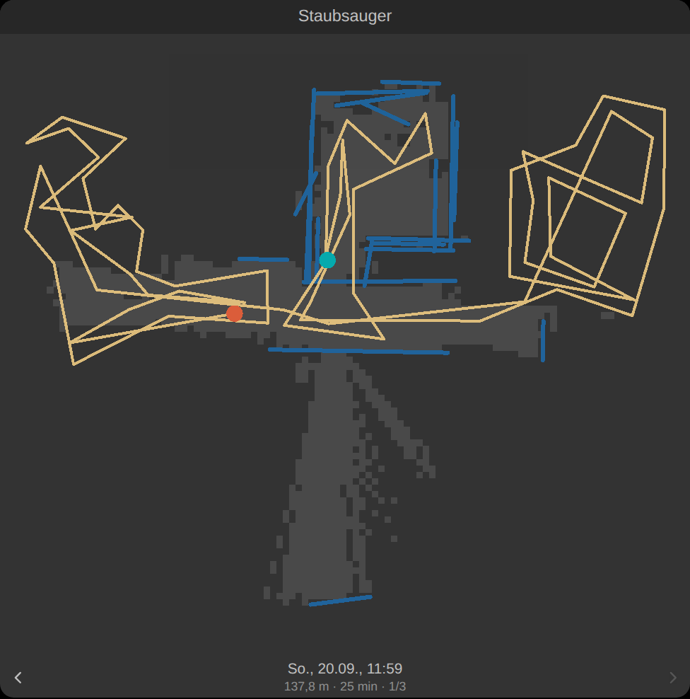
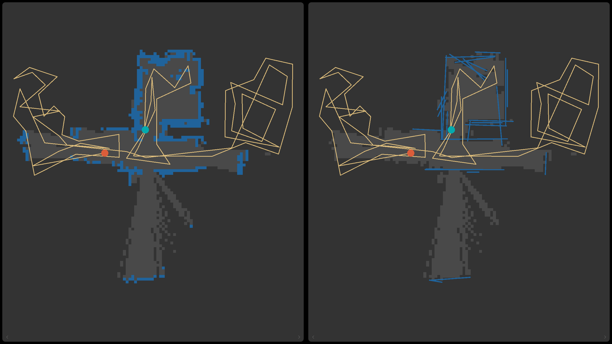

# ftui-neato-map

Eine FTUI3-Komponente, die die Reinigungskarte eines Neato Botvac anzeigt –
das Belegungsgitter aus den Lidar-Scans, die gefahrene Spur darüber, und die
aufgezeichneten Läufe zum Durchblättern.



Die Daten kommen vom FHEM-Modul [`74_NeatoLocal`](https://github.com/chrisse1/neato-FHEM).
Das Modul zeichnet auf und schreibt eine Datei je Lauf; gezeichnet wird hier.
Am Modul ändert diese Komponente nichts.

## Was gebraucht wird

* FTUI3 ([knowthelist/ftui](https://github.com/knowthelist/ftui)), installiert
  in `<fhem>/www/ftui/`
* `74_NeatoLocal` mit eingeschalteter Aufzeichnung:

  ```
  attr <Gerät> trackRuns 1
  attr <Gerät> mapInterval 30      # Lidar-Scans; ohne das nur die Spur
  ```

* Die Sitzungsdateien müssen unter `www/` liegen, sonst gibt FHEMWEB sie nicht
  heraus. Der Standard `trackDir` (`./www/neato`, also `/opt/fhem/www/neato/`)
  passt: FHEMWEB liefert das als `/fhem/neato/<Datei>.jsonl` aus, mit
  `Content-Type: text/jsonl`. Die Komponente bildet diese Adresse selbst aus
  `track-dir` und der FHEMWEB-Adresse, die sie von FTUI erfragt – damit stimmt
  sie auch für eine Seite in einem Unterordner. Liegt `trackDir` woanders unter
  `www/`, reicht `track-dir="./www/<Ordner>"`.

## Installation

Über FHEMs eigenen Update-Mechanismus, in der FHEM-Kommandozeile:

```
update add https://raw.githubusercontent.com/chrisse1/fhem-ftui-components-neatomaps/HEAD/controls_neatomaps.txt
update all https://raw.githubusercontent.com/chrisse1/fhem-ftui-components-neatomaps/HEAD/controls_neatomaps.txt
```

Das erste Kommando merkt sich die Quelle (in `FHEM/controls.txt`), das zweite
holt die Dateien. Ab da genügt ein `update`, das dann alle eingetragenen
Quellen durchgeht. Ein `shutdown restart` ist nicht nötig – es sind nur
Dateien unter `www/`; im Browser kann aber ein beherzter Reload nötig sein,
damit die alte Fassung nicht aus dem Cache kommt.

Was dabei wohin geht:

| Datei | |
|---|---|
| `www/ftui/components/neato/` | die Komponente, drei Dateien |
| `www/ftui/examples/neato-map.html` | Beispielseite, **nur angelegt** (`CRE`), nie überschrieben – sie enthält einen Gerätenamen, den man anpasst |

Wer lieber von Hand arbeitet, kopiert dasselbe Verzeichnis selbst:

```sh
git clone https://github.com/chrisse1/fhem-ftui-components-neatomaps
cp -r fhem-ftui-components-neatomaps/www/ftui/components/neato \
      /opt/fhem/www/ftui/components/
```

So oder so ist mehr nicht nötig: FTUI lädt zu `<ftui-neato-map>` von sich aus
`components/neato/neato-map.component.js`.

## Benutzung

```html
<ftui-grid-tile row="1" col="1" width="6" height="5">
  <ftui-grid-header>Staubsauger</ftui-grid-header>

  <ftui-neato-map device="Staubsauger"
                  [track-file]="Staubsauger:trackFile"
                  [state]="Staubsauger:state"></ftui-neato-map>
</ftui-grid-tile>
```

Die Karte nimmt die Größe der Kachel an – den ganzen Platz unterhalb des
Kachelkopfs – und zeichnet sich bei jeder Größenänderung neu, ohne die Daten
noch einmal zu lesen.

Geblättert wird mit den Pfeilen, mit Wischen oder mit den Pfeiltasten, und
zwar entlang der Zeit: **rechts geht Richtung Gegenwart, links in die
Vergangenheit.** Beim Öffnen steht der neueste Lauf da, der rechte Pfeil ist
also grau, bis man einmal nach links geblättert hat.

`[track-file]` und `[state]` sind nicht Pflicht, aber nützlich: das erste meldet
einen neuen Lauf, sobald er beginnt, das zweite schaltet die Live-Ansicht ein.
Solange `state` auf `cleaning` steht, wird die laufende Aufzeichnung alle
`refresh-interval` Sekunden nachgeladen.

## Attribute

| Attribut | Standard | Bedeutung |
|---|---|---|
| `view` | – | Leer zeigt eine Aufzeichnung, `plan` den gemeinsamen Grundriss aus mehreren. |
| `plan-file` | – | Fertiger Grundriss neben den Aufzeichnungen, z. B. `plan-Staubsauger.json`. Ohne den wird im Browser gerechnet – siehe unten, warum das ab einer Handvoll Läufen keine gute Idee ist. |
| `plan-runs` | `4` | Wie viele der neuesten Läufe in einen selbst gerechneten Grundriss eingehen. |
| `plan-agree` | `0.5` | Welcher Anteil der Läufe, die hingesehen haben, eine Zelle Wand nennen muss. |
| `show-disputed` | an | Zellen zeichnen, die ein Lauf Wand nennt und die anderen Boden. |
| `device` | – | Name des NeatoLocal-Geräts. Bestimmt, welche Dateien aufgelistet werden. |
| `dir` | aus `track-dir` | URL-Verzeichnis der Sitzungsdateien. Leer heißt: aus dem letzten Teil von `track-dir` und der FHEMWEB-Adresse bilden, also `/fhem/neato/`. Nur setzen, wenn die Dateien woanders ausgeliefert werden. |
| `track-dir` | `./www/neato` | Dasselbe Verzeichnis, wie FHEM es sieht – nur für die Dateiliste. Entspricht dem Attribut `trackDir` des Geräts. |
| `track-file` | – | Reading `trackFile`, zum Binden. Nennt die laufende bzw. letzte Sitzung. |
| `state` | – | Reading `state`, zum Binden. `cleaning` schaltet die Live-Ansicht ein. |
| `index` | `0` | Welcher Lauf gezeigt wird, 0 ist der neueste. Bindbar in beide Richtungen. |
| `limit` | `20` | Wie viele Läufe durchblätterbar sind. |
| `file` | – | Genau eine Datei zeigen, ohne Liste und ohne Blättern. |
| `files` | – | Feste Liste von Dateinamen, durch Komma getrennt. Dann wird FHEM nicht nach der Liste gefragt. |
| `list-command` | – | Eigenes FHEM-Kommando für die Liste, falls das eingebaute nicht passt. |
| `refresh-interval` | `30` | Sekunden zwischen zwei Leseversuchen während eines Laufs, `0` schaltet das ab. |
| `walls` | `dots` | Wie die Wände gezeichnet werden: `dots` setzt ein Quadrat je gemessener Zelle, `lines` zieht gerade Linien daraus, `cells` füllt dieselben Zellen zu einer Fläche. |
| `dot-size` | `0.72` | Kantenlänge eines Punkts als Anteil der Zelle. Unter 1 bleibt eine Lücke zwischen Nachbarn – die macht den Unterschied zwischen einem Raster und einem Klotz. |
| `align` | an | Die Umdrehungen vor dem Zeichnen aufeinanderlegen. Kostet bei einem Stundenlauf rund 0,4 s und ist der Grund, warum eine Wand eine Linie ist. |
| `line-tolerance` | `0.04` | Wie weit ein Messpunkt von seiner Linie abweichen darf, in Metern. Größer heißt glatter und ungenauer. |
| `join-gap` | `0.8` | Bis zu welcher Lücke zwei Stücke derselben Flucht zu einer Wand verbunden werden. `0` verbindet nichts. |
| `join-offset` | `0.12` | Wie weit zwei Stücke quer zur Richtung auseinanderliegen dürfen, um als dieselbe Wand zu gelten. Zu streng lässt eine Wand als Bündel paralleler Striche stehen, zu großzügig macht aus zwei Wänden eine. |
| `join-angle` | `4` | Wie viel Grad zwei Stücke sich unterscheiden dürfen. |
| `min-wall` | `0.6` | Kürzere Stücke werden weggelassen – Stuhlbeine, Kabel, Kistenecken. |
| `close-corners` | an | Ecken schließen, die der Lidar nie gesehen hat. |
| `corner-reach` | `0.8` | Wie weit zwei Wandenden dafür höchstens verlängert werden, in Metern. |
| `clearance` | `0.1` | Halbe Breite des Roboters: Wo seine Spur läuft, wird eine Wandlinie gekappt. Negativ schaltet die Regel ab. |
| `snap-angle` | `8` | Wie weit ein Stück von der vorherrschenden Richtung abweichen darf, um darauf eingerastet zu werden, in Grad. `0` rastet nichts ein. |
| `cell` | `0.10` | Zellgröße des Belegungsgitters in Metern. |
| `threshold` | `0.25` | Ab welchem Anteil Treffer eine Zelle als Wand gilt. |
| `min-seen` | `2` | Wie oft eine Zelle beobachtet sein muss, bevor sie überhaupt zählt. |
| `pad` | `0.4` | Rand um die Karte in Metern. |
| `rotate` | `auto` | Wie herum die Karte liegt. `auto` dreht sie in die Vierteldrehung, die die Kachel am besten füllt; `0`, `90`, `180`, `270` legen sie fest, im Uhrzeigersinn. |
| `show-track` | an | Die gefahrene Spur zeichnen. |
| `show-points` | aus | Die rohen Endpunkte statt des Belegungsgitters zeichnen. |
| `show-info` | an | Zeile mit Datum, Strecke, Dauer und Zähler. |
| `show-controls` | an | Die Pfeile zum Blättern. |
| `show-missed` | aus | Den Boden schraffieren, über den die Bürste nie gefahren ist, und die Abdeckung in die Zeile schreiben. Bei einer ausgedünnten Aufzeichnung passiert nichts – siehe unten. |
| `brush-width` | `0.32` | Breite des Roboters in Metern. Alles, was näher als die Hälfte davon an der Spur liegt, gilt als gesaugt. |
| `show-stuck` | an | Einen Ring um die Stellen zeichnen, an denen er abseits der Basis stehen geblieben ist. |
| `stuck-seconds` | `20` | Ab wann das ein Stehenbleiben ist. `0` schaltet es ab. |
| `text-size` | `0.8` | Schriftgröße der Zeile unter der Karte. Eine bloße Zahl ist em (wie bei `margin` in FTUI), sonst gilt jede CSS-Länge: `text-size="1.4"`, `text-size="16px"`. |
| `arrow-size` | `1.9` | Kantenlänge der Blätterpfeile, in denselben Einheiten. Ohne Angabe wachsen sie mit `text-size` mit. |
| `min-height` | `4` | Wie flach die Kartenfläche schrumpfen darf, wenn der Platz knapp wird. |
| `wall-color` | `primary` | Farbe der Wände. |
| `free-color` | Textfarbe | Farbe der befahrenen Fläche. |
| `free-opacity` | `0.16` | Wie deutlich die Fläche gegen den Untergrund steht. |
| `track-color` | `warning` | Farbe der gefahrenen Spur. |
| `point-color` | `info` | Farbe der Endpunkte bei `show-points`. |
| `dot-color` | wie `wall-color` | Farbe der Punkte bei `walls="dots"`, falls sie sich von den Wandlinien unterscheiden soll. |
| `start-color` | `success` | Punkt am Anfang des Laufs. |
| `end-color` | `danger` | Punkt am Ende – und der Punkt für den Roboter, solange er fährt. |
| `missed-color` | `danger` | Farbe der Schraffur über dem ausgelassenen Boden. |
| `stuck-color` | `danger` | Farbe des Rings um eine Stelle, an der er stehen blieb. |
| `disputed-color` | `danger` | Farbe der strittigen Zellen im Grundriss. |
| `text-color` | `light` | Farbe der Zeile und der Pfeile. |
| `background-color` | durchsichtig | Untergrund der Kartenfläche; ohne Angabe scheint die Kachel durch. |
| `locale` | Seitensprache | `de` oder `en`, für Datum und die wenigen Texte. |

In einem Popup ist die Kachelschrift oft zu klein; dort lohnen beide:

```html
<ftui-popup width="50%" height="60%" timeout="0" shape="round">
  <ftui-popup-header>Staubsauger</ftui-popup-header>
  <ftui-neato-map device="Staubsauger"
                  [track-file]="Staubsauger:trackFile"
                  [state]="Staubsauger:state"
                  text-size="1.4" arrow-size="3"></ftui-neato-map>
</ftui-popup>
```

Die Karte füllt das Popup-Fenster genauso wie eine Kachel.

### Farben

Die Farbattribute nehmen, was CSS nimmt – und zusätzlich die Farbnamen, die
FTUI überall sonst verwendet (`primary`, `warning`, `danger`, `red`, …). Die
kommen aus dem Thema, passen sich also mit ihm an:

```html
<ftui-neato-map device="Staubsauger"
                wall-color="info"
                track-color="#ffb454"
                free-color="rgb(120, 130, 140)"
                free-opacity="0.22"
                end-color="danger"></ftui-neato-map>
```

Ohne Angabe bleibt es beim Thema: Wände in `primary`, Spur in `warning`,
Anfang in `success`, Ende in `danger`. Ein Attribut wieder auf `""` zu setzen
stellt den Standard zurück.

Jedes dieser Attribute setzt nichts weiter als eine CSS-Variable, die sich auch
direkt setzen lässt – etwa für alle Karten einer Seite auf einmal:
`--neato-map-wall-color`, `--neato-map-free-color`,
`--neato-map-free-opacity`, `--neato-map-point-color`,
`--neato-map-track-color`, `--neato-map-start-color`, `--neato-map-end-color`,
`--neato-map-background`, `--neato-map-text-color`, `--neato-map-font-size`,
`--neato-map-arrow-size`, `--neato-map-min-height`,
`--neato-map-wall-width` (Strichstärke der Wandlinien in Pixeln) und
`--neato-map-button-background`.

## Wie die Liste der Läufe zustande kommt

FHEMWEB liefert Dateien aus, aber kein Verzeichnis. Die Komponente fragt FHEM
deshalb nach den Namen – ein Perl-Ausdruck, gebaut aus `track-dir` und `device`:

```
{ join("\n", reverse sort map { (split m,/,)[-1] } <./www/neato/Staubsauger-*.jsonl>) }
```

Der Ausdruck enthält bewusst kein Semikolon: FHEM zerlegt eine Kommandozeile an
`;`, bevor es sich die geschweiften Klammern ansieht.

Wenn die Installation keine Perl-Kommandos über FHEMWEB zulässt
(`allowedCommands`), bleibt die Liste leer. Die Komponente zeigt dann den Lauf
aus dem Reading `trackFile` – also den aktuellen – und sonst einen Hinweis.
Zwei Auswege:

* `files="Staubsauger-2026-09-20_11-59-11.jsonl, …"` – feste Liste, kein
  Kommando nötig.
* `list-command="get myList sessions"` – ein eigenes Kommando, dessen Ausgabe
  Dateinamen sind, durch Zeilenumbruch oder Komma getrennt.

## Drei Arten, dieselben Wände zu zeigen

```html
<ftui-neato-map walls="dots"></ftui-neato-map>    <!-- Standard -->
<ftui-neato-map walls="lines"></ftui-neato-map>
<ftui-neato-map walls="cells"></ftui-neato-map>
```

`dots` zeichnet jede gemessene Zelle als eigenes Quadrat, ein wenig kleiner als
die Zelle, sodass zwischen Nachbarn ein Haar Untergrund bleibt. Genau diese
Lücke macht den Unterschied: Eine Wand liest sich als Reihe von Messungen, ein
unsicherer Bereich franst sichtbar aus, statt so auszusehen wie ein sicherer.
Deshalb ist das der Standard – es ist die ehrlichste der drei Ansichten.

`lines` ist die aufgeräumteste: gerade Wände, rechte Winkel, geschlossene
Ecken, und was einmal durch den Scan lief, fällt heraus. Was sie nicht zeigt,
ist, wie sicher sie sich ist – eine Linie sieht immer gleich entschlossen aus.
Bei einer dünnen Aufzeichnung ist sie trotzdem die lesbarere.

`cells` füllt dieselben Zellen zu einer Fläche. Das ist dieselbe Information
wie `dots`, sieht aber klobig aus; es ist vor allem zum Nachsehen da.

## Warum eine Wand eine Linie ist

Der Roboter weiß auf ein paar Zentimeter genau, wo er steht. Über eine Stunde
Fahrt machen diese Zentimeter aus einer Wand ein Bündel paralleler Striche:
Dieselbe Wand, um zehn nach zehn und noch einmal um halb zwölf gesehen,
landet nicht an derselben Stelle. Dagegen hilft keine Art zu zeichnen – die
Striche liegen wirklich woanders.

Also werden sie verschoben. Jede Umdrehung wird ein wenig gerückt – ein paar
Zentimeter, ein, zwei Grad –, bis ihre Punkte möglichst gut auf die Karte
passen, die alle anderen zeichnen; und das ein paar Mal. Es ist die grobe
Verwandte dessen, was der Roboter intern mit weit mehr Umdrehungen tut, als
er aufschreibt.

An einem echten Stundenlauf über eine ganze Wohnung gemessen (595
Umdrehungen, 156 000 Punkte): Die Scans stimmen danach **40 % besser**
überein (0,039 → 0,024 Zellen je Punkt, das Maß aus `tools/track_map.py`),
und aus 156 Wandsegmenten werden 68 – eine Linie je Wand statt eines
Bündels. Es kostet rund 0,4 s, einmal beim Laden.

**Die gefahrene Spur bleibt unangetastet.** Die Posen sind das, was der
Roboter gefahren ist; gerückt werden nur die Scans, und nur für die Karte.
Wer das nicht will: `align="false"`.

## Warum die Karte ruhiger ist als die Messung

Eine Wohnung besteht aus geraden Wänden, meist rechtwinklig zueinander. Ein
Lidar, der dieselbe Wand aus vier Positionen sieht, legt vier leicht
verschiedene Punktreihen darauf – als Zellen gezeichnet ein unscharfes Band,
als Linie gezeichnet eine Wand. Die Komponente zieht deshalb Linien, in vier
Schritten:

1. Eine Umdrehung wird an den Sprüngen zerlegt: Wo die Entfernung springt,
   ist der Strahl an einer Kante vorbei auf etwas anderes getroffen.
2. Jedes Stück wird dort geteilt, wo es knickt – am Punkt, der am weitesten
   von der Verbindung seiner Enden abliegt, solange er weiter als
   `line-tolerance` abliegt.
3. Stücke, die auf derselben Geraden liegen, werden verbunden, auch über die
   Lücken hinweg, die Möbel und Türöffnungen lassen (`join-gap`) – aber nur,
   solange die gemeinsame Gerade ihre Punkte weiter trägt, und nur, wenn sie
   wirklich dieselbe Gerade sind (`join-offset`, `join-angle`). Diese beiden
   Schranken sind der empfindlichste Teil: In einer möblierten Wohnung mit
   hunderten Umdrehungen findet sich zu jedem Stück irgendein Partner, der
   zufällig passt – wenn man großzügig genug ist. Dann laufen plötzlich
   Linien diagonal durch Räume.
4. Stücke, die fast parallel zur vorherrschenden Richtung liegen, werden
   genau parallel dazu gedreht (`snap-angle`). Diese Richtung wird gemessen,
   nicht angenommen: Es ist die, auf die sich die längsten Wände einigen.
   Steht die Dockingstation schräg zur Wohnung, ist es eben eine schräge.

### Wo er gefahren ist, ist keine Wand

Der Roboter ist eine Scheibe von gut 30 cm, kein Gespenst. Eine Linie, die
seine Fahrspur kreuzt, kann keine Wand sein – er hätte hindurchfahren müssen.
Solche Linien werden an der Kreuzung gekappt, mitsamt seiner halben Breite
(`clearance`) zu beiden Seiten; der Rest der Wand bleibt stehen. In der
geprüften Aufzeichnung waren das sieben Stellen.

Dieselbe Regel entscheidet auch, welche Ecke geschlossen werden darf.

### Geschlossene Ecken

Wo zwei Wände im rechten Winkel zusammenstoßen, sieht der Lidar die Ecke
selbst meistens nicht: Er blickt an der einen Wand entlang, dann an der
anderen, und dazwischen bleibt eine Lücke von ein paar Dezimetern. Beide
Linien werden bis zu ihrem Schnittpunkt verlängert.

**Das ist das einzige Stück Geometrie auf dieser Karte, das nicht gemessen,
sondern geschlossen wurde** – und nur, wo der Schluss sicher ist: Die Ecke
muss nah sein (`corner-reach`), der Winkel muss ein Eckwinkel sein, und der
Roboter darf nicht durch die Stelle gefahren sein, an der die Ecke läge. Eine
Türöffnung, durch die er gefahren ist, bleibt offen. `close-corners="false"`
schaltet es ab, dann endet jede Wand dort, wo sie gemessen wurde.

**Was die Vereinfachung nicht tut:** entscheiden, was Wand ist. Das bleibt
Sache des Belegungsgitters. Eine Linie wird nur gezeichnet, wo das Gitter sie
stützt – und genau daran scheitert, wer gerade durch den Scan läuft: Die
Strahlen der anderen Umdrehungen gingen durch die Stelle hindurch, an der die
Person stand, also zählt das Gitter die Zellen als frei, und die Linie fällt
weg. Wer stehen bleibt, ist Möbel und bleibt auf der Karte. Eine Säule bleibt
rund, weil eine Gerade durch sie ihre Punkte nicht mehr trägt. Und hinter dem
letzten gemessenen Punkt hört jede Linie auf; eine Ecke, die nie gesehen
wurde, wird nicht geschlossen.

Das ist in `test/walls.test.mjs` festgehalten, an Lidar-Aufnahmen eines
gerechneten Zimmers: vier Wände werden vier Linien, die durchlaufende Person
verschwindet, die stehende Kiste bleibt, die Säule bleibt rund, die ungesehene
Ecke bleibt offen.

Wem das zu viel Deutung ist: `walls="cells"` zeigt weiter die Zellen, die das
Gitter als Wand zählt – die rohe Evidenz, ohne jede Glättung.



Dieselbe Aufzeichnung, links `walls="cells"` mit 158 Rechtecken, rechts der
Standard mit 26 Linien.

## Mehrere Läufe als ein Grundriss

```html
<ftui-neato-map device="Staubsauger" view="plan"
                plan-file="plan-Staubsauger.json"></ftui-neato-map>
```

Drei Arten Zelle, und der Unterschied zwischen ihnen ist der ganze Grund,
mehrere Läufe zu nehmen: worauf sie sich einigen (voll gezeichnet), was nur
einer je gesehen hat (blass – niemand widerspricht, niemand bestätigt), und was
einer Wand nennt, während die anderen hinsahen und Boden fanden (eigene Farbe).
Die Zeile darunter nennt die Zahl der Läufe, die sichere Wandfläche und wie
viele Zellen strittig sind.

Ein einzelner Lauf ist die Karte *dieses Laufs*: eigener Nullpunkt, eigene
Nordrichtung, und er kennt nur die Räume, in die der Roboter an dem Tag kam.
Legt man mehrere übereinander, geht zweierlei, was keiner allein kann – die
fehlenden Wände kommen dazu, und über jede Zelle kann abgestimmt werden. Was
acht von zehn Läufen Wand nennen, ist Wand; was einer Wand nennt, während die
anderen an dieselbe Stelle sahen und Boden fanden, war der Wäscheständer.

Das Zusammenlegen ist dasselbe Problem, das `neato-align.js` innerhalb eines
Laufs löst, eine Etage höher: dort wird eine Umdrehung um Zentimeter gerückt,
hier ein ganzer Lauf gedreht. Der Unterschied ist, dass nichts vorher bekannt
ist – weder Drehung noch Versatz. Bezahlbar wird das über die vorherrschende
Wandrichtung: die misst jeder Lauf, und zwei Läufe derselben Wohnung können
sich nur um deren Differenz plus ein Vielfaches des rechten Winkels
unterscheiden. Vier Kandidaten statt hundertzwanzig – an drei echten Läufen
gemessen rund 0,2 s statt 8 s pro Lauf.

An genau diesen drei Läufen (einer über eine Stunde, zwei kürzere vom Vortag):

| | |
|---|---|
| gefundene Drehungen | 89,5° und 90,3°, Versatz unter 15 cm |
| Wandzellen im Plan | 2658 gegenüber 1816 im dichtesten Lauf allein |
| davon wirklich neues Gebiet | 381 Zellen = 3,8 m² Wand, die der Stundenlauf nicht hat |
| strittig | 52 Zellen = 0,5 m² – Verdacht auf Möbel, Personen, offene Türen |
| Rechenzeit | 0,8 s Aufnehmen, 0,6 s Zusammenlegen |

Zwei Dinge behauptet das ausdrücklich **nicht**. Erstens, dass die Läufe einen
gemeinsamen Nullpunkt haben – in diesen Aufzeichnungen haben sie einen, die
Basis steht am selben Fleck, aber die Suche verlässt sich nicht darauf.
Zweitens, dass mehr Läufe immer besser sind: zwei Läufe vom selben Nachmittag
sehen dieselben Möbel am selben Platz und sind sich aus dem falschen Grund
einig. Die Abstimmung ist nur so unabhängig wie die Läufe.

Ein Lauf, der nicht passt, wird **abgelehnt** statt hineingebogen – eine andere
Etage in denselben Rahmen zu zwingen zieht Wände quer durch Räume.

### Wo der Grundriss gerechnet wird

Ohne `plan-file` rechnet die Komponente ihn selbst, aus den neuesten
`plan-runs` Aufzeichnungen. Für drei oder vier geht das. Darüber hinaus nicht
mehr, und das sagen Zahlen statt eines Gefühls – in Chromium gemessen, mit
gedrosselter CPU für ein Tablet:

| | |
|---|---|
| drei Läufe laden, lesen, aufnehmen, zusammenlegen | 1,2 s – auf Tablet-Tempo **5,2 s** |
| dabei heruntergeladen | 2,0 MB |
| zehn Läufe à 1 Stunde bei `mapInterval 15` | etwa **5,5 MB** |
| derselbe Grundriss als fertige Datei | 33 kB, **7 kB** gzip |

Ein Panel, das den Grundriss zeigt, sollte also die Antwort laden, nicht die
Frage. Die schreibt:

```sh
node tools/make-plan.mjs /opt/fhem/www/neato Staubsauger --runs 8
```

Heraus kommt `plan-Staubsauger.json` neben den Aufzeichnungen, und FHEMWEB
liefert sie genauso aus wie diese:

```json
{ "cell": 0.1, "runs": 3, "built": "…", "cells": [[ix, iy, walls, seen], …] }
```

Zellindizes statt Metern, weil sie das sind und die Datei klein bleibt.
`walls` ist, wie viele Läufe die Zelle Wand nennen, `seen`, wie viele
überhaupt hingesehen haben – beides braucht die Anzeige, um eine Wand, der
niemand widerspricht, von einer zu unterscheiden, die alle bestätigen.

**Dieses Dateiformat ist die Naht.** Wer den Grundriss rechnet, ist dahinter
austauschbar: dieses Werkzeug, ein Aufruf aus FHEM heraus, oder eines Tages
das Modul selbst. Die Komponente zeichnet nur noch. Ein Browser-Test hält
beide Wege gegeneinander und besteht nur, wenn dasselbe Bild herauskommt.

## Wie der Lauf gelaufen ist

Zwei Dinge stehen in der Aufzeichnung, die man der Karte nicht ansieht.
`neato-run.js` rechnet sie aus, beide aus der Fahrspur, beide ohne das Modul
anzufassen.

### Was er ausgelassen hat

`show-missed` schraffiert den Boden, über den die Bürste nie gefahren ist, und
schreibt die Abdeckung in die Zeile darunter. Der Roboter ist eine Scheibe von
32 cm, also gilt alles als gesaugt, was näher als 16 cm an seiner Spur liegt;
was das Belegungsgitter frei nennt und die Spur nicht erreicht hat, blieb
liegen – die andere Seite einer Tür, durch die er nur geschaut hat, die Ecke
hinter dem Stuhl, das Zimmer, in das er nicht kam. Die Handbreit an jeder Wand
gehört dazu: näher kommt eine Scheibe nicht heran.

An zwei echten Läufen gemessen: 86 % einer ganzen Wohnung in einer Stunde,
74 % bei einem Lauf, der vorzeitig endete. Kosten rund 10 ms, deshalb wird es
nur gerechnet, wenn es eingeschaltet ist.

**Bei einer ausgedünnten Aufzeichnung passiert nichts.** Liegen zwischen zwei
Posen zwanzig Sekunden, war der Roboter dazwischen irgendwo, und eine gerade
Linie durch die Wohnung wäre erfunden. Solche Schritte werden gezählt statt
überbrückt; sind es mehr als 5 %, gibt es weder Schraffur noch Zahl. Eine Zahl
unter einer Karte wird geglaubt – lieber keine als eine erfundene.

### Wo er stehen geblieben ist

Am Ende jedes fertigen Laufs steht der Roboter still: an der Basis. Steht er
zwanzig Sekunden lang irgendwo *sonst*, tut er das nicht freiwillig – er hängt
an einer Teppichkante, klemmt unter einem Schrank, ein Rad dreht nicht mehr.
`show-stuck` zeichnet einen Ring darum, die Sekunden stehen im Tooltip.

Dass er sich dabei dreht, spricht nicht dagegen: in der einen Aufzeichnung, die
so endete, drehte er sich in diesen 21 Sekunden um 39 Grad – er versuchte,
freizukommen.

## Was die Karte zeigt

Ein Lidar-Strahl, der bei drei Metern endet, hat auch gemessen, dass der Weg
dorthin frei war. Genau das macht aus einer Punktwolke eine Karte: jede Zelle
zwischen Sensor und Endpunkt zählt als Durchgang, die Zelle des Endpunkts als
Treffer, und `treffer / (treffer + durchgänge)` entscheidet. Hinter dem
Endpunkt wird nichts behauptet.

Die Rechnung steht in `neato-track.js` und ist das Gegenstück zu `tools/track_map.py`
im Modul-Repo; das Verfahren und die Koordinatenkonvention sind dort in
[`docs/ftui3-map.md`](https://github.com/chrisse1/neato-FHEM/blob/dev/docs/ftui3-map.md)
beschrieben. Zwei Fallen, die dort stehen und hier in Tests eingemauert sind:

* Die Formel für die Punkte ist **gemessen**, nicht hergeleitet. Ihre
  Spiegelung sieht in einer halbwegs symmetrischen Wohnung fast genauso
  ordentlich aus. `test/session.test.mjs` vergleicht darum Zelle für Zelle mit
  dem Ergebnis der Python-Referenz, nicht nur die Anzahl.
* In SVG wächst `y` nach unten, in den Daten nach oben.

Und was die Karte *nicht* ist: kein Grundriss der Wohnung, sondern des Laufs.
Fehlt ein Raum, war der Roboter nicht drin. Jeder Lauf hat seinen eigenen
Nullpunkt und seine eigene Nordrichtung, und die Komponente zeigt immer genau
einen.

### Wie herum die Karte liegt

Der Roboter hat keinen Kompass. Sein Nullpunkt ist da, wo er losgefahren ist,
und seine x-Achse zeigt dorthin, wo er in dem Moment hingeschaut hat. Dieselbe
Wohnung kommt darum je nach Lauf hochkant oder quer heraus – nicht weil die
Karte schief wäre, sondern weil die Basis um einen rechten Winkel anders stand
oder er beim Start ein Stück gedreht hatte. Zwei Läufe aus derselben Wohnung:

| | Startwinkel | Ausdehnung | vorherrschende Richtung |
|---|---|---|---|
| ganze Wohnung | 182° | 9,4 × 14,7 m, hochkant | 0,0° |
| halbe Wohnung | 0° | 11,6 × 8,8 m, quer | 89° |

Deshalb dreht `rotate="auto"` die Karte auf die Vierteldrehung, die die Kachel
besser ausnutzt, statt sich auf eine Richtung zu verlassen, die es in den Daten
nicht gibt. Gedreht wird nur die Zeichnung: Die Messwerte bleiben, wie sie sind.
Wer es fest haben will, schreibt `rotate="90"` – im Uhrzeigersinn, wie eine
gedrehte Fotografie. Ändert die Kachel ihre Form, wird die Vierteldrehung neu
entschieden und nur neu gezeichnet; gelesen und gerechnet wird nichts noch
einmal.

Gerechnet wird beim Laden, im Haupt-Thread. Für die Referenzaufzeichnung sind
das rund 15 ms, für einen echten Lauf über eine ganze Wohnung – 595 Scans,
156 000 Punkte, eine Stunde – rund 60 ms: Das Gitter wächst mit der Wohnung, nicht mit der
Datenmenge, und für die Linien reichen 120 Umdrehungen, weil die übrigen
dieselben Wände noch einmal zeigen. Welche Zellen Wand sind, entscheidet
weiterhin jeder einzelne Strahl. Ein Worker lohnt nicht.

## Entwickeln und Prüfen

Die Rechnung lässt sich ohne Roboter, ohne FHEM und ohne Browser prüfen:

```sh
node --test test/session.test.mjs      # nur die Karten-Mathematik
node --test test/align.test.mjs        # das Aufeinanderlegen der Umdrehungen
node --test test/walls.test.mjs        # die Vereinfachung der Wände
node --test test/run.test.mjs          # ausgelassener Boden und Stehenbleiben
node --test test/plan.test.mjs         # mehrere Laeufe als ein Grundriss
node --test test/controls.test.mjs     # der Index für FHEMs update
```

Die Referenzaufzeichnung ist ausgedünnt, taugt also nicht, um den
ausgelassenen Boden zu prüfen. Dafür gibt es einen erfundenen Raum mit dichter
Spur, dessen Antwort von Hand bekannt ist – 5 × 4 m, in Bahnen bis x = 3,6
gefahren, dann stehen geblieben:

```sh
node tools/make-room-fixture.mjs       # schreibt test/fixtures/room-run.jsonl
node tools/make-plan.mjs <verz> <geraet>   # schreibt plan-<geraet>.json
```

`controls_neatomaps.txt` nennt Größe und Zeitstempel jeder Datei, und FHEM
verwirft eine Datei, deren Größe nicht auf das Byte stimmt. Nach jeder
Änderung an `www/` also:

```sh
tools/make_controls.sh
```

Wird das vergessen, schlägt `test/controls.test.mjs` fehl – dafür ist er da.

Die Standardwerte der Vereinfachung sind an *einer* Aufzeichnung gemessen.
Ob sie für eine dichtere passen, beantwortet keine Meinung, sondern:

```sh
node tools/tune-walls.mjs /opt/fhem/www/neato/<Datei>.jsonl karte.svg
```

Das stellt für eine Reihe von Einstellungen die Zahl der Segmente (wie ruhig
das Bild ist) der Abdeckung gegenüber (wie viel von dem, was das Gitter Wand
nennt, die Linien wirklich treffen) und schreibt die Karte als SVG zum
Ansehen. Besser ist, was die erste Zahl senkt, ohne die zweite zu senken.
Neue Einträge in `CHANGED` gehören nach oben, vor die erste Leerzeile: FHEM
zeigt beim Update genau diesen Block an.

`test/fixtures/reference-track-botvac-d6.jsonl` ist die echte, ausgedünnte
Aufzeichnung aus dem Modul-Repo; `test/fixtures/expected-grid.json` enthält das,
was die Python-Referenz daraus macht, und wird mit
`tools/expected_from_python.py <Pfad zum neato-FHEM-Klon>` neu erzeugt.

Für die Prüfung im Browser – Kachelgröße, Blättern, die Liste aus FHEM, die
Live-Ansicht – braucht es FTUI und Playwright:

```sh
test/get-ftui.sh                       # Klon nach ./.ftui
npm install                            # Playwright
npx playwright install chromium
node --test test/browser.test.mjs
```

Der Test startet ein FHEMWEB-Double (`test/harness/fake-fhem.mjs`), legt die
Komponente über den FTUI-Klon und fährt eine echte FTUI-Seite auf. Fehlt FTUI
oder Playwright, überspringt er sich selbst.

`node tools/screenshot.mjs` macht daraus das Bild oben.

## Lizenz

MIT, wie FTUI. Siehe [LICENSE](LICENSE).
